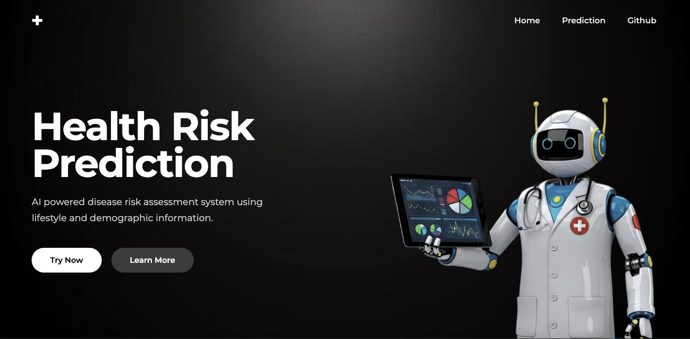
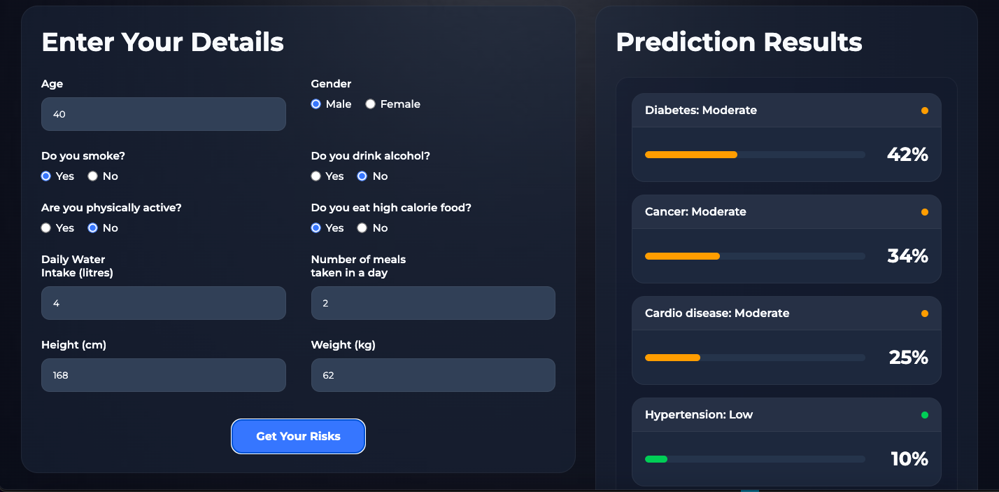

# Health Risk Prediction

A machine learning powered web application that predicts the likelihood of developing lifestyle-related diseases based on demographic and lifestyle information.

The project exposes a REST API that orchestrates multiple independently trained machine learning models through a unified interface. The frontend consumes metadata from the backend to dynamically render supported disease models, making the application easily extensible without frontend changes.

## Homepage



## Prediction Dashboard



### Live Demo

https://health-risk-prediction.netlify.app/


---

## Overview

Most disease prediction projects are built around a single model. This project takes a different approach.

Each disease has its own independently trained machine learning model with its own dataset, feature set and algorithm. The backend acts as an orchestration layer that routes the user's lifestyle data to the appropriate models, collects their predictions and returns a single response.

The frontend never hardcodes supported diseases. Instead, it discovers available models through the metadata endpoint and builds the interface dynamically.

---

## Features

- Multiple independently trained ML models
- Dynamic frontend generated from backend metadata
- REST API built with FastAPI
- Input validation using Pydantic
- Percentage-based risk prediction
- Responsive frontend built with vanilla HTML, CSS and JavaScript
- Easily extensible architecture for adding new disease models

---

## Supported Disease Models

- Diabetes
- Cardiovascular Disease
- Hypertension
- Obesity
- Cancer

Each model has its own:

- Dataset
- Training notebook
- Trained model
- Feature set
- Description

---

# Tech Stack

## Frontend

- HTML
- CSS
- JavaScript

## Backend

- FastAPI
- Pydantic

## Machine Learning

- Scikit-Learn
- Pandas
- NumPy
- Pickle
- Jupyter Notebook

## Deployment

Frontend: Netlify

Backend: Render

---

# Architecture

```

Frontend
│
▼
REST API
│
▼
FastAPI Backend
│
▼
Models Manager
│
├──────────────┐
▼              ▼
Model A     Model B     ...
│              │
▼              ▼
Prediction   Prediction
└──────┬──────┘
       ▼
Combined Response
       │
       ▼
Frontend Dashboard

```

---

# Backend Design

The backend is intentionally modular.

## models/

Every disease model is stored inside its own directory.

Each model contains:

- Training dataset
- Jupyter notebook used for training
- Serialized pickle model

This makes every model self-contained and easy to retrain independently.

---

## models_info.json

This file acts as the registry for every available model.

It stores information such as

- model name
- pickle location
- description
- required input features

Whenever a new model is added, only this file needs to be updated.

---

## models_info.py

Contains the **InfoManager** responsible for reading and managing the model registry.

This allows the API to automatically expose information about every available model.

---

## models_manager.py

This is the orchestration layer of the application.

It contains two major classes.

### Model

Represents a single machine learning model.

Responsibilities:

- Load pickle model
- Select required features
- Construct model-specific dataframe
- Generate prediction

### Models_Manager

Coordinates every model.

Responsibilities:

- Load all available models
- Accept master user input
- Distribute relevant features to each model
- Collect predictions
- Generate metadata for the API

This abstraction allows every model to remain completely independent.

---

## requests_manager.py

Contains the Pydantic request model used for validating incoming API requests.

It also converts validated requests into the internal dictionary format expected by the Models_Manager.

---

## app.py

The FastAPI entry point.

Available routes:

### GET /get_info

Returns metadata describing every available disease model.

Example:

- model names
- descriptions
- required parameters
- feature information

This endpoint is used by the frontend to dynamically generate UI components.

---

### POST /results

Accepts validated lifestyle data and returns prediction percentages for every supported disease.

Example response

```json
{
    "diabetes": 12.4,
    "cancer": 4.2
}
```

---

# Request Schema

The prediction endpoint validates every request using Pydantic.

Required information includes:

- Age
- Gender
- Height
- Weight
- Smoking status
- Alcohol consumption
- Physical activity
- Water intake
- Meal frequency
- High calorie food consumption

BMI is calculated internally using the provided height and weight before being passed to the relevant models.

---

# Dynamic Frontend

One design decision I'm particularly happy with is avoiding hardcoded disease information.

Instead, the frontend requests metadata from:

```

GET /get_info

```

The backend returns information about every available model including:

- Description
- Required features
- Input metadata

The homepage automatically generates the disease cards from this endpoint.

Adding another disease model requires **no frontend modifications**.

---

# Machine Learning Pipeline

The models were trained individually using publicly available healthcare datasets, primarily sourced from Kaggle.

Many of these datasets contained clinical measurements that would not normally be available to an average user. During preprocessing, those features were removed so that predictions rely only on demographic and lifestyle-related information.

Different diseases are better suited to different algorithms, so each model was trained independently using the algorithm that produced the best performance for that dataset.

Algorithms used across the project include:

- Logistic Regression
- Decision Trees
- Random Forests

---

# Project Structure

```

health-risk-prediction/

├── frontend/
│
├── backend/
│   │
│   ├── app.py
│   ├── models_manager.py
│   ├── models_info.py
│   ├── requests_manager.py
│   │
│   └── models/
│       ├── diabetes/
│       ├── cancer/
│       ├── obesity/
│       ├── hypertension/
│       └── cardio/

```

---

# Running Locally

Clone the repository.

```bash
git clone https://github.com/ayaan0604/health-risk-prediction.git
```

## Backend

```bash
cd backend

pip install -r requirements.txt

uvicorn app:app
```

The API will be available locally.

---

## Frontend

Open the `frontend` directory.

Update the API URL inside:

```

frontend/homepage/script.js

```

to point to your local FastAPI server.

Then open `index.html`.

---

# Future Improvements

- Authentication and user history
- Additional disease models
- Explainable AI (feature importance)
- Confidence intervals
- Model versioning
- Automated retraining pipeline
- Docker deployment

---

## Author

**Ayaan Ansari**

GitHub:
https://github.com/ayaan0604

Live Demo:
https://health-risk-prediction.netlify.app/